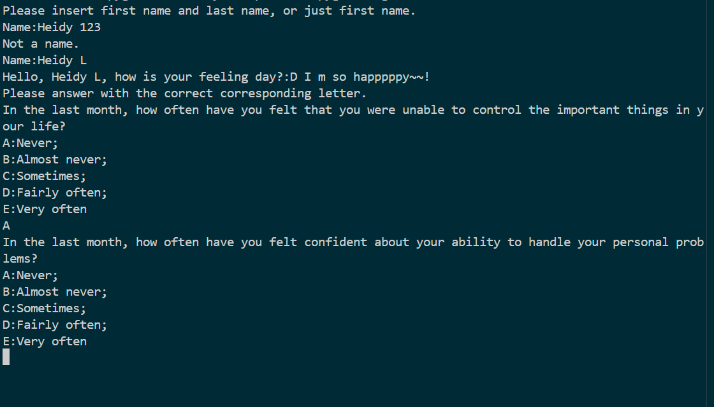

# Cope with Stress-Python Application

### Overview:
Stress is something everyone experiences in daily life, this project helps users understand their stress level.

It is based on a short survey from the *Perceived Stress Scale (PSS-4)* (Cohen et al., 1983) to identify their stress level: **High**, **Medium**, or **Low**. 

It was built using Python, depending on the results, the program will guide the users to different relaxing activities.
---
### Features:
This project contains three main files: **`project.py`**, **`click.py`**, and **`snake.py`**.

#### `project.py`
1. Validates user input (name,mood).

2. Presents PSS-4 questions one by one.

3. Calculates stress score using Dictionary lookup.

4. Directs users to diary, mini-games, or relaxing music.

   - **`low_open_file`**: Opens a text file where the user can write freely about stress-free feelings, or make a to-do list as motivation.
   - **`mid_game_`**: Randomly selects and launches one of the two mini-games (`click.py` or `snake.py`).
   - **`high_music`**: Opens a random relaxing music video from YouTube in the browser with import of webbrowser.  

#### `click.py`
This is a mini-game created with **Pygame**.
- The goal is to click as many circles as possible within 30 seconds.
- The game generates circles in random positions, sizes, and colors.
- At the end, the program displays the user’s final score before returning to the main program.

#### `snake.py`
This is another mini-game created with **Pygame**.
- The player controls a snake using the arrow keys (**up, down, left, right**).
- The snake grows longer each time it eats the target “fruit”.
- The game ends when the snake hits the screen border or collides with itself.
- There is no time limit, so users can play at their own pace as a way of relaxation.
---

### Demo/Screenshots:
#### Video Demo: <https://youtu.be/uo7xhitIFmE>

*Terminal interface showing the stress test*

 
*Snake game interface*

---

### How to run:
1. platform able to run Python 

2. install modules show in requirements.txt using:
   ```bash
   pip install -r requirements.txt
   ```

4. run the program using:
   ```bash
   python project.py
   ```
---

### Project Structure:
```
.
├── project.py
├── click.py
├── snake.py
└── assets/
    ├── code_with_stress_terminal.png
    └── pygame_snake.png
```
---

### What I Learned:
- Pygame basics
- Game logic and event handling
- Regex 
- Input validation
- Modular programming
- File handling
- Webbrowser module
---

### Future Improvements:
There are several possible future improvements for this project:
- **Graphical User Interface (GUI):** Making the program GUI-based (instead of text-based) would make it more accessible and visually appealing.
- **Data recording:** Generating a CSV file to record the user’s stress levels over time and visualize trends with charts.
- **More activities:** Adding new games, music playlists, or guided breathing/meditation exercises could be included to provide more variety.
- **Expanded survey:** Increasing the number of questions could improve the accuracy and representativeness of the stress-level assessment.
---

### Credit:
CS50P Final Project


